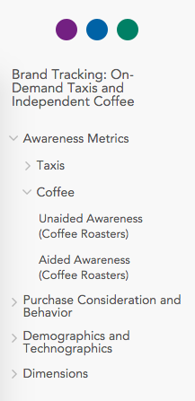

# Crunch Kata

Welcome to the Crunch Kata! The purpose of this exercise is evaluate your
skills in:

1. Automated Testing
2. Problem solving
3. AngularJS

## Solution Information

In order to run the tests for this solution please first install the dependencies, then run `npm test`:

```
npm install
npm test
```

### Assumptions

1. One of the requirements was to have a service to get a variables "position in the order". It was not clear what this "position" would look like. As such, I have assumed that it is a numeric position within a hierarchical structure represented as an Array of numbers, beginning with the position at the top level, then the second level, and so forth.

2. The term "variable name" was used in an inconsistent manner. I have assumed it to mean the variable identifier (non-English) for the function to retrieve a variable's position in the order given its "name" since the actual name of the data within a variable does not appear in the order.json file.

3. I have also assumed that have a single factory/service for the various functions is acceptable. The alternative seems to be having a single function in each service, which would not be a sound architectural decision.

## Problem description

You're working on an application that enables its users to explore survey data. These surveys contain many questions, or *variables*, which may be grouped and organized in a tree-like structure to make them easier to find. Your job is to develop a web component that displays these variables following the specified order structure. (A different team is implementing the interface for arranging the variables into that order--that's not your responsibility.)

The backend team has provided two test fixtures that you can use to start developing the feature. The first one, `variables.json`, is the catalog of variables found in a dataset. The second, `order.json`, represents the order in which these variables should be displayed. Each entry in `order.json` maps to an item in `variables.json`.

## Instructions

The deliverable should contain the following:

1. An AngularJS directive that displays the variable catalog following its hierarchical order. It should be easy to tell the group to which a variable belongs, i.e.

    

2. A service that accepts a variable's name and returns the variable's position in the order.
3. A service that accepts a position in the order and returns a variable.
4. An HTTP layer that requests the two fixtures.
5. Automated tests that confirm that your code works.

## About the tools

We only have one hard requirement: AngularJS.

## Deliverable

Publish your work in a GitHub repository.
